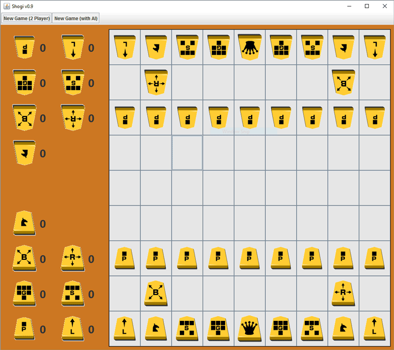

# Shogi: Traditional Japanese Chess 🀄

Welcome to **Shogi**, a Java/Swing implementation of the traditional Japanese chess game. This project is part of a software maintenance initiative.



## 📜 About
This project is designed to provide a digital version of Shogi, with a focus on maintaining and improving software quality. The game is implemented using Java, leveraging the Swing library for the graphical user interface.

## 🚀 Features
- **Classic Shogi gameplay**: Experience traditional Japanese chess.
- **Interactive GUI**: User-friendly interface for a smooth gaming experience.

## 🛠 Installation
To run the game locally:
1. Clone the repository:
    ```bash
    git clone https://github.com/JuliaMStahl/shogi.git
    ```
2. Navigate to the project directory and compile the code:
    ```bash
    cd shogi
    javac -d out/production/Shogi src/*.java
    ```
3. Run the game:
    ```bash
    java -cp out/production/Shogi Main
    ```

## 🎮 Usage
- Use the graphical interface to play Shogi against the computer or a friend.

## 🧰 Technologies Used
- **Java**: Core programming language.
- **Swing**: For creating the graphical user interface.

## 🌟 Contributing
Feel free to fork the project and submit pull requests. Contributions are welcome!

---
